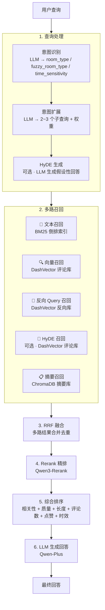
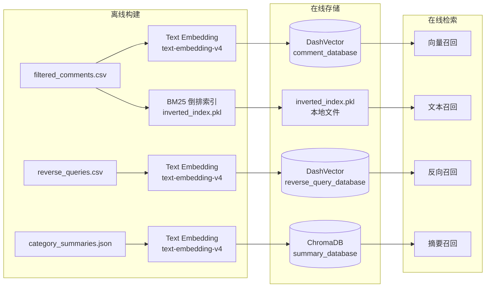
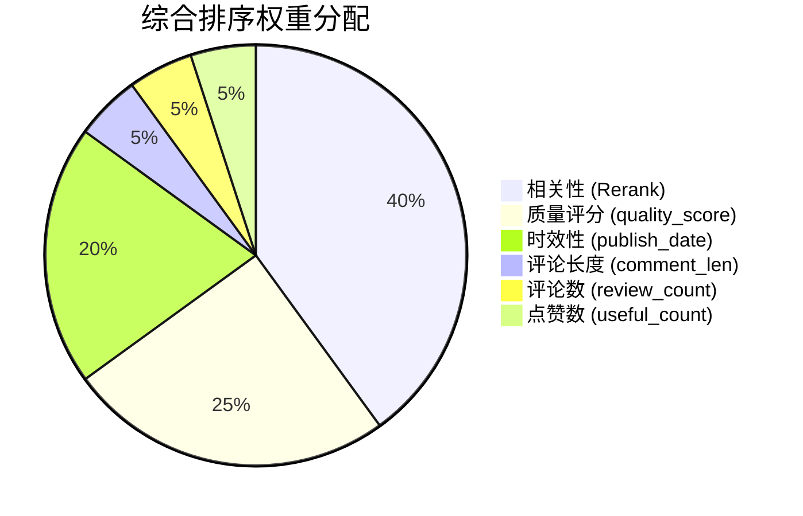

# 酒店评论智能问答 RAG Pipeline

基于 RAG（检索增强生成）的酒店评论智能问答系统，围绕广州花园酒店的住客评论数据，实现多路检索 + 重排序 + LLM 生成的端到端问答流程。

## 系统架构

### 整体 Pipeline 流程



### 数据流与存储架构



### 综合排序权重



## 项目结构

```
Exp3/
├── pipeline.py                 # 完整 RAG Pipeline（主入口）
├── RAG_components.ipynb        # RAG 核心组件教学 Notebook
├── 酒店评论知识库构建.ipynb      # 知识库离线构建 Notebook
├── 演示示例.ipynb               # 端到端演示 Notebook
├── Exp3.pdf                    # 实验说明
├── HW3.pdf                     # 作业说明
└── data/
    ├── filtered_comments.csv   # 过滤后的酒店评论数据
    ├── reverse_queries.csv     # 反向查询数据
    ├── category_summaries.json # 分类摘要数据
    ├── stopwords_chinese.txt   # 中文停用词表
    ├── inverted_index.pkl      # BM25 倒排索引（构建后生成）
    └── chroma_db/              # ChromaDB 持久化目录（构建后生成）
```

## 核心模块说明

### `pipeline.py` 中的类与函数

| 组件 | 说明 |
|------|------|
| `EmbeddingClient` | 封装阿里云 text-embedding-v4，支持 document/query 模式 + instruct 指令 |
| `InvertedIndex` | BM25 倒排索引，支持中文分词（jieba）、停用词过滤、构建/检索/保存/加载 |
| `HotelReviewRAG` | 主 Pipeline 类，串联查询处理→多路召回→RRF融合→Rerank→综合排序→LLM生成 |
| `build_knowledge_base()` | 离线知识库一键构建函数（评论库 + 反向Query库 + 摘要库 + 倒排索引） |
| `print_rag_result()` | 格式化输出 RAG 结果（回答 + 延迟统计 + 召回路由 + Top 评论） |

### Pipeline 各阶段详解

#### 1. 查询处理
- **意图识别**：调用 Qwen-Plus 提取房型偏好（room_type / fuzzy_room_type）和时效性关注（time_sensitivity）
- **意图扩展**：将原始查询拆解为 2~3 个子查询，每个带权重，覆盖不同方面
- **HyDE 生成**（可选）：让 LLM 生成假设性回答，用该回答的向量去检索，弥补查询与文档的语义鸿沟

#### 2. 多路召回
- **文本召回**（BM25）：基于关键词精确匹配，擅长专有名词/实体词检索
- **向量召回**（DashVector）：基于语义相似度，擅长模糊/抽象查询
- **反向 Query 召回**（DashVector）：用预生成的反向查询问题做语义匹配，桥接查询-文档语义差距
- **HyDE 召回**（可选）：用假设回答的向量检索评论
- **摘要召回**（ChromaDB）：先匹配评论类别摘要，提供宏观背景信息

#### 3. RRF 融合
使用 Reciprocal Rank Fusion 将多路召回结果合并，公式：`score(d) = Σ 1/(k + rank_i)`，k=60

#### 4. Rerank 精排
调用 Qwen3-Rerank（Cross-Encoder）对融合后的候选文档按与查询的相关性重排序

#### 5. 综合排序
多维度加权评分：`0.4×相关性 + 0.25×质量 + 0.05×长度 + 0.05×评论数 + 0.05×点赞 + 0.2×时效`

#### 6. LLM 生成
将摘要 + Top-K 评论作为上下文，调用 Qwen-Plus 生成最终回答

## 快速开始

### 1. 安装依赖

```bash
pip install dashscope dashvector chromadb jieba nltk pandas
```

### 2. 设置环境变量

```bash
export DASHSCOPE_API_KEY="your-dashscope-api-key"
export DASHVECTOR_API_KEY="your-dashvector-api-key"
export DASHVECTOR_HOTEL_ENDPOINT="your-dashvector-endpoint"
```

### 3. 构建知识库（首次使用）

```bash
python3 pipeline.py --build
```

该命令会依次构建：
- DashVector 评论向量库（comment_database）
- DashVector 反向 Query 向量库（reverse_query_database）
- ChromaDB 摘要向量库（summary_database）
- BM25 倒排索引（inverted_index.pkl）

### 4. 查询

```bash
# 单次查询
python3 pipeline.py --query "酒店的床舒服吗？睡眠质量怎么样？"

# 启用 HyDE 召回（更精准但更慢）
python3 pipeline.py --query "早餐怎么样？" --hyde

# 交互式模式
python3 pipeline.py --interactive

# 指定数据目录
python3 pipeline.py --query "酒店位置方便吗？" --data-dir ./data
```

### 5. 在 Python 中使用

```python
from pipeline import HotelReviewRAG, print_rag_result

rag = HotelReviewRAG(
    api_key="your-api-key",
    dashvector_api_key="your-dv-key",
    dashvector_endpoint="your-endpoint",
    data_dir="data",
)

result = rag.query("酒店的床舒服吗？睡眠质量怎么样？", enable_hyde=False)
print_rag_result(result)
```

## 数据说明

### filtered_comments.csv
广州花园酒店住客评论，包含评论内容、评分、房型、出行类型、质量评分等字段。

### reverse_queries.csv
为每条评论预生成的反向查询问题，用于"反向召回"——用户查询与这些生成的问题做语义匹配，从而找到相关评论。

### category_summaries.json
13 个评论类别（整体满意度、餐饮设施、前台服务等）的结构化摘要，每个类别包含关键词、详细摘要和评论数量。

## 技术栈

| 组件 | 技术 |
|------|------|
| 文本嵌入 | 阿里云 text-embedding-v4（1024 维） |
| 云向量数据库 | 阿里云 DashVector |
| 本地向量数据库 | ChromaDB |
| 关键词检索 | BM25（jieba 分词） |
| 重排序 | Qwen3-Rerank |
| 大语言模型 | Qwen-Plus |
